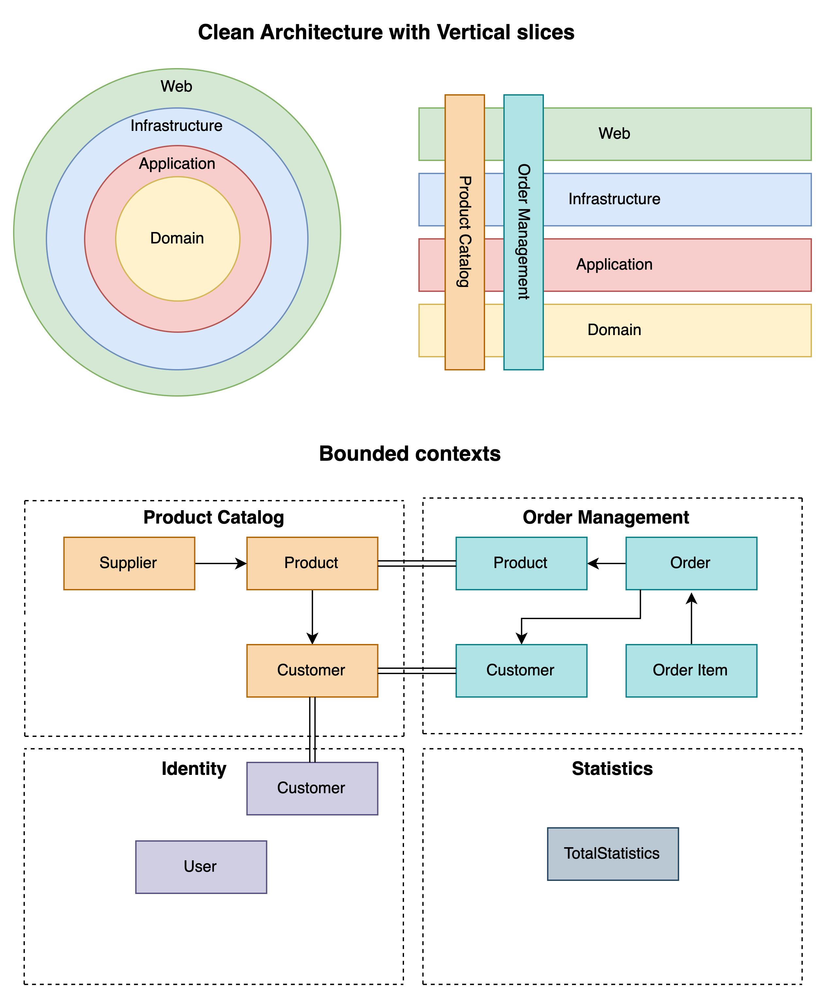

# .NET Domain Driven Design implemented with Clean Architecture and Vertical slices

This template aims to facilitate the development of highly decoupled monolithic .NET applications, with the flexibility to transition to microservices if your business needs evolve.

<div align="center">
  
</div>

## Key Features

* **Bounded Contexts Separation**: Each bounded context is isolated in its own project, significantly minimizing the risk of domain coupling. This approach allows for independent domain development within a monolithic structure.

* **Streamlined Development**: By consolidating all contexts into the StartupProject, the solution avoids the complexity of managing multiple microservice deployments. This allows for frictionless development without overhead while maintaining strict separation between domains.

## Running the solution

* Set a connection string for your database

* Migrations - execute the bash script to create the project migrations - ./run_migrations.sh

## :bulb: Core Principles

Many DDD projects struggle to strictly prevent unintentional coupling between bounded contexts. This issue often arises because the domains are part of the same project, and developers have the freedom to use dependencies that don't belong to a specific bounded context. Those that do address this issue often separate bounded contexts into independent projects. While this approach avoids coupling, it introduces significant DevOps overhead, such as microservice orchestration, service discovery, and common NuGet package management. This template resolves coupling issues by separating contexts into individual projects, but ensures they all run within a single binary, thus avoiding excessive DevOps complexity.

### Domain Modeling and Development Process

To start with Domain-Driven Design, it’s useful to engage deeply with your customers to grasp the intricacies of the business domain and use cases. This initial step is pivotal for defining your bounded contexts, aggregate roots, and value objects.

When designing your bounded contexts, prioritize their ability to function autonomously. If you find that two domains are consistently used together, consider merging them. Conversely, if specific use cases from one domain are frequently utilized independently, consider splitting them into distinct domains.
> Explicitly define the context within which a model applies. Explicitly set boundaries in terms of team organization, usage within specific parts of the application, and physical manifestations such as code bases and database schemas. Keep the model strictly consistent within these bounds, but don’t be distracted or confused by issues outside — Eric Evans

### CQRS & Repositories

In .NET, repositories primarily act as anti-corruption layers for aggregate roots or for implementing CQRS, especially if you're looking to decouple from Entity Framework (such as moving READ operations to Dapper). If your project doesn't leverage these benefits, using DbContext directly can simplify development.

Consider organizing your repositories into Query and Domain repositories: Query repositories return response objects and are typically housed in the Application project, while Domain repositories return Domain objects and are defined within the Domain project.

### Anti-corruption layers and validation

Factories and Repositories serve as crucial anti-corruption layers, complementing fluent validations. Domain objects are internal and must only be created through Factories. Validation is implemented across all layers, with a particular emphasis on the domain layer. Ensuring the core domain is properly validated and bug-free is essential, as invalid state or bugs at this level will propagate to the rest of the layers.

## Database Storage

### One or Multiple Databases

You have two primary options for data storage:

* (Recommended) Use a single database for all domains, with each domain having its own bounded context. This approach simplifies development and speeds up the process. Transitioning to microservices later will require only a migration script for the data.
* Use a separate database for each domain. This simplifies the transition to microservices since you only need to split the domain into a separate repository. However, managing multiple databases from the beginning can slow down development somewhat.

### DB initialization and Seeding

To create your own database initializers, follow these steps:

* Extend DbInitializer: Create a new class in the Infrastructure layer that inherits from the DbInitializer class.
* Define your seed data: define a class that extends IInitialData next to your entities and implement the **GetData** method to return the result.
* Pass the seed data to your DB initializer constructor.
* Override **Initialize** Method (if needed): If custom initialization behavior is required, override the Initialize method in your DB initializer class.

## Communication Between Bounded Contexts

Bounded contexts communicate either through Event Sourcing or API calls.

For instance, if you need to keep track of statistics such as the number of orders placed in a day, a solution could involve triggering an ‘OrderCreated’ Domain Event within the OrderManagement domain, which would then be captured and processed by the Statistics Domain.

### How to use Domain Events

All entities extend the **Entity** class, which contains the interface for raising events.

```cs
public abstract class Entity : IEntity
{
    private readonly ICollection<IDomainEvent> events;

    protected Entity() => events = new List<IDomainEvent>();

    public IReadOnlyCollection<IDomainEvent> Events
        => events.ToList().AsReadOnly();

    public void ClearEvents() => events.Clear();

    protected void RaiseEvent(IDomainEvent domainEvent)
        => events.Add(domainEvent);

    ...
}
```

How to Raise an event:

```cs
public class Order : Entity, IAggregateRoot
{
    public Order(Guid customerId, DateTime orderDate)
    {
        ...

        RaiseEvent(new OrderAddedEvent());
    }
}
```

Example **Event Handler**:

```cs
public class OrderAddedEventHandler : IEventHandler<OrderAddedEvent>
{
    private readonly IStatisticsDomainRepository statistics;

    public OrderAddedEventHandler(IStatisticsDomainRepository statistics)
        => this.statistics = statistics;

    public Task Handle(OrderAddedEvent domainEvent)
        => statistics.IncrementProducts();
}
```

All event handlers are extending the **IEventHandler** interface, which get automatically registered into DI via the assembly scanner in .NET.

## :construction_worker: Built with

* [.NET Core 8](https://github.com/dotnet/core)
* [ASP.NET Core 8](https://github.com/dotnet/aspnetcore)
* [Entity Framework Core 8](https://github.com/dotnet/efcore)
* [MediatR](https://github.com/jbogard/MediatR)
* [FluentValidation](https://github.com/FluentValidation/FluentValidation)
* [AutoMapper](https://github.com/AutoMapper/AutoMapper)
* [Scrutor](https://github.com/khellang/Scrutor)
* [xUnit](https://github.com/xunit/xunit)
* [FluentAssertions](https://github.com/fluentassertions/fluentassertions)

## For more details on the template, feel free to read my article on Medium
[https://medium.com/@evgeni.n.rusev/net-domain-driven-design-template-with-a-vertical-slice-architecture-33812c22b509](https://medium.com/@evgeni.n.rusev/net-domain-driven-design-template-with-a-vertical-slice-architecture-33812c22b509)
