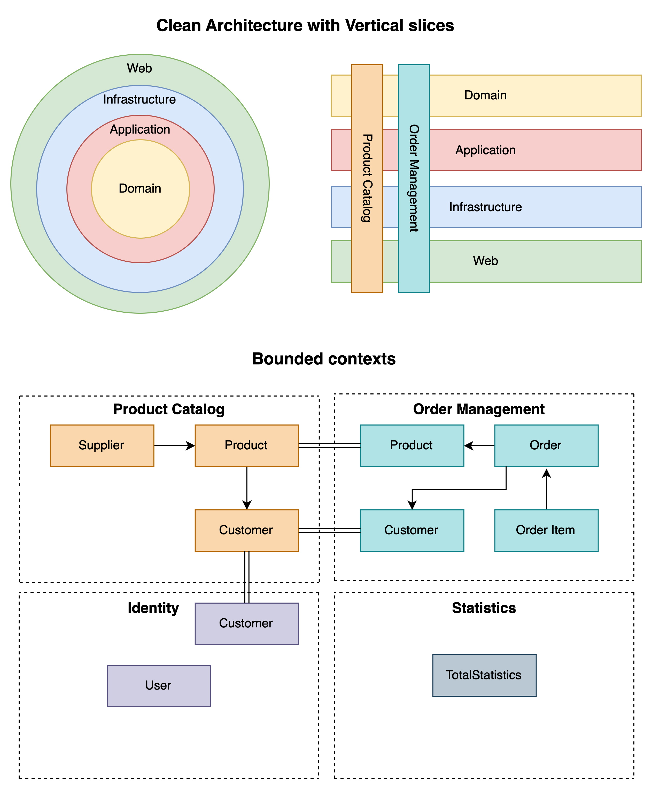

# .NET Domain Driven Design implemented with Clean Architecture and Vertical slices.
This template aims to facilitate the development of highly decoupled monolithic .NET applications, with the flexibility to transition to microservices if your business needs evolve.

Key Features:
- Bounded Contexts Separation: Each bounded context is isolated in its own project, significantly minimizing the risk of domain coupling. This approach allows for independent domain development within a monolithic structure.
- Streamlined Development: By consolidating all contexts into the StartupProject, the solution avoids the complexity of managing multiple microservice deployments. This enables rapid development akin to a monolith while maintaining strict separation between domains.

  

### Running the solution:
- Migrations - execute the bash script to create the project migrations - ./run_migrations.sh
- Set a connection string for your database

## Core Philosophy
Most DDD project templates fail to prevent unintentional coupling of bounded contexts. Those that do address this issue often separate bounded contexts into independent projects. While this approach avoids coupling, it introduces significant DevOps overhead, such as microservice orchestration, service discovery, and common NuGet package management. Our template resolves coupling issues by separating contexts into individual projects, but ensures they all run within a single binary, thus avoiding excessive DevOps complexity.

### Domain Modeling and Development Process
Begin by extensively communicating with your customers to gain a thorough understanding of the business domain and use cases. Use this insight to divide the domains or vertical slices in a way that allows them to operate independently. If you frequently find two domains being used together, consider merging them. Conversely, if you regularly use only specific use cases from one domain independently of others, consider splitting them into separate domains.

### Data Storage
You have two primary options for data storage:
- (Recommended) Use a single database for all domains, with each domain having its own bounded context. This approach simplifies development and speeds up the process. Transitioning to microservices later will require only a migration script for the data.
- Use a separate database for each domain. This simplifies the transition to microservices since you only need to split the domain into a separate repository. However, managing multiple databases from the beginning can slow down development somewhat.reduce development speed a bit.

### Anti-corruption layers and validation
Factories and Repositories serve as crucial anti-corruption layers, complementing fluent validations. Validation is implemented across all layers, with a particular emphasis on the domain layer. Ensuring the core domain is properly validated and bug-free is essential, as invalid state or bugs at this level will propagate to the rest of the layers.

### Communication Between Bounded Contexts
Contexts communicate through event sourcing or API calls.

Things to document:
1. internal proeperties in Domain. Only factories can instanciate domain objects.
2. Validation - can use custom exceptions if needed
3. Repositories - query and domain. Explain diff.
	Query repository return Response objects. They must reside in Application because it needs to know about the response. 
	Domain repository works purely with the domain objects, hence it should be in Domain.
4. Hangfire cron jobs
5. Domain events
6. Should add health checks? Consider it
7. Scrutor for DI
8. Migrations
9. How to run the project
10. Build with section
11 - AUTOMAPPER - automatic mapping profile
12. Each project is responsible for registering its services via an 'Add' abstraction. (For example AddDomain)
13. Bounded context separation via Repository
14. TODO: remove secrets and explain where to set secret
15. Resolve issue with DBInitializer comment
16. Rename solution
17 Create aggregator solution if there is a solution that can't fit existing context, or just merge contexts.
18. Bounded contests - think of them like microservices within a single solution.
19. add unit tests
20. Rename ProjectStartup to Startup

TODO: consider renaming back to Product and Orders because it's more intuitive.

Workflow:
1. Workflow to create a use case - starting from domain, controller, use case, repository, configuration etc..

How to define your bounded contexts - “Explicitly define the context within which a model applies. Explicitly set boundaries in terms of team organization, usage within specific parts of the application, and physical manifestations such as code bases and database schemas. Keep the model strictly consistent within these bounds, but don’t be distracted or confused by issues outside” - Eric Evans